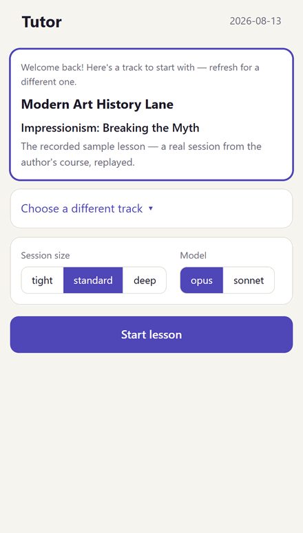

# tutor

A self-hosted AI tutoring app with a split brain: **deterministic code does all
the bookkeeping** — curriculum progression, topic selection, prior knowledge, validation,
write-back — so **the AI only does what the AI is needed for: personalized and adaptive teaching.**

**[▶ Try the demo](https://liujon23.github.io/tutor/)** — a real lesson from the
author's art-history course, replayed in the actual app. 

<p align="center">
  
</p>

## The core idea: teachers should adapt and improvise, but their memories shouldn't.

Most AI tutor setups drift: the model half-remembers what you know, re-asks
settled questions, and loses the thread between sessions. Here the model never
keeps the books. Before each lesson, *code* assembles a session packet with
everything the tutor needs to know: lesson topic/goals and student information. 
After each lesson, the tutor hands back a structured session patch/debrief, 
which *code* validates, applies, and commits. Course recordkeeping is stable and 
deterministic, so the tutor's "memory" is too. 

**Every lesson is one git commit.** Your entire learning history is a readable git log. 
The tutor's only write path is the validated post-lesson patch — it can never quietly 
corrupt your curriculum. 

The system also *learns how you learn*: lessons accumulate (and reliably remember)
observations about what works for you, and a gated flow (the tutor proposes, you approve) 
promotes them into confirmed patterns that shape future lessons.

## The app

A PWA served by a small Fastify + Claude Agent SDK server on your own machine —
install it on your phone and study from anywhere on your
[Tailscale](https://tailscale.com/) network, on **your own Claude subscription**
(a token from `claude setup-token`, or a metered API key).

- **Streaming lessons** with rendered LaTeX, syntax-highlighted code, embedded
  artwork and diagrams — built for all kinds of subjects.
- **Photo attachments** — send handwritten work for the tutor to read and grade honestly.
- **Per-message feedback**: long-press any tutor message to rate it. Strong negative ratings
course-correct the tutor mid-lesson; everything else is distilled at wrap-up into durable
observations about how you learn. The tutor is learning your habits directly from your participation as well.
- **Spaced recall**: previously-covered topics from the day's track are occasionally quizzed
lightly (if you want) — each clean recall pushes a topic's next quiz exponentially further out,
and related stale topics get bundled into a single bridging question.
- **Session sizes** (tight / standard / deep) and per-lesson model choice, with
  a live switch if you hit your subscription's rate window.
- **Curriculum viewer**: see a whole track at once as a flowchart of units laid
  out from their prerequisites, each showing what it covers, how far in you are,
  and when you finished it. Open a unit to read any of its lessons back — every
  committed lesson keeps a full transcript.
- **Stats screen**: token/cost trends, per-lane progress, feedback history.
- **Wrap-up receipts**: every lesson ends with what was committed, what it cost,
  and what's queued next.

## Course Design

The `course-setup` skill designs a course with you, in
conversation. It'll ask for your goals with the course, conduct a sweep 
of what you already know so lessons don't re-teach
it, then you'll co-design a unit/topic skeleton with curated information sources. It runs in
[Claude Code](https://claude.com/claude-code) (open this folder and say *"I want
to start learning X"*) — course authoring is a structural conversation, so it
lives next to the code rather than in the app. 

## Limitations
- **AI CAN MAKE MISTAKES**. The tutor has web-search capabilities, so you can
always tell it to verify any of its claims online, but since you are likely not
an expert in the subject (or else you wouldn't need to learn it from a silly
vibecoded tutor), it's good to be extra vigilant.
- This app is totally vibe-coded. I have read most of the prose (e.g. directives
for how the LLM should teach) but almost none of the code itself. It is written
mostly by Fable 5, with some upkeep by Opus 4.8+. It is a relatively straightforward
and self-contained app which should have little surface for cybersecurity issues,
but no promises.
- On that note, it is also not designed with efficiency in mind. It is not slow,
but there are some delays, as there would be if you were chatting with an LLM tutor
in its native app.
- The tutor speaks Claude-ese. Sorry. It just is what it is. It doesn't bug me enough
to try to nudge it away from that, and I'm not sure there's an easy way to do so, but
some wording in your learner profile (or telling it through feedback when it says
something that's particularly Claude-like) might help. There's also definitely some
sycophancy that I have tried to nudge it away from.
- This app makes no attempt to motivate you to learn. There are no streaks, or achievements,
or reminder notifications, or guilt-tripping, or anything like that. If you need extrinsic
motivation to learn, maybe find a buddy to learn something together. Or sign up for a class.

## Quickstart

```bash
git clone https://github.com/liujon23/tutor && cd tutor
npm run setup          # install + build, with sanity checks
claude setup-token     # prints a token — put it in .env (cp .env.example .env)
npm run serve          # open http://127.0.0.1:4321
```

The repo ships with three example courses — how modern LLMs work,
Science & Technology Studies, and modern art history — so your first lesson
works out of the box in your web browser. For keeping your data in its own
repo, setting up your own courses, and accessing the tutor from your phone:
**[SETUP.md](SETUP.md)**. 


## Docs

- **[SETUP.md](SETUP.md)** — first-time setup, phone access, where your data lives
- **[APP.md](APP.md)** — the full ops reference: auth, usage tracking, env knobs
- **[ARCHITECTURE.md](ARCHITECTURE.md)** — how the code fits together, with a
  guided reading order
- **[CLI.md](CLI.md)** — running lessons in the terminal instead, and the
  deterministic script toolbox (validation, exports, usage reports)

## License

[MIT](LICENSE)
