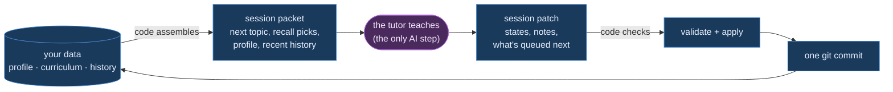

# tutor

A self-hosted AI tutoring app with a split brain: **deterministic code does all
the bookkeeping** — curriculum state, topic selection, spaced recall, validation,
write-back, git versioning — so **the AI only does what AI is for: teaching.**

**[▶ Try the demo](https://liujon23.github.io/tutor/)** — a real lesson from the
author's art-history course, replayed in the actual app. No account needed.

<!-- demo GIF goes here once captured from the live Pages deploy -->

## The one idea: rigid scaffolding, fluid teaching

Most AI-tutor setups drift: the model half-remembers what you know, re-asks
settled questions, and loses the thread between sessions. Here the model never
keeps the books. Before each lesson, code assembles a *session packet* —
everything the tutor needs to know, computed, not recalled. After each lesson,
the tutor hands back one structured *session patch*, which code validates,
applies, and commits. The lesson in between is freeform teaching.

## How a lesson works



**Every lesson is one git commit.** A bad session is one `git revert` away, and
your entire learning history is a readable git log. The tutor's only write path
is the validated patch — it can never quietly corrupt your curriculum.

The system also *learns how you learn*: lessons accumulate observations about
what works for you, and a gated flow (the tutor proposes, you approve) promotes
them into confirmed patterns that shape every future lesson.

## The app

A PWA served by a small Fastify + Claude Agent SDK server on your own machine —
install it on your phone and study from anywhere on your
[Tailscale](https://tailscale.com/) network, on **your own Claude subscription**
(a token from `claude setup-token`, or a metered API key).

- **Streaming lessons** with rendered LaTeX, syntax-highlighted code, embedded
  artwork and diagrams — built for math and close-looking alike.
- **Photo attachments** — send handwritten work or a textbook page for the tutor
  to read and grade honestly.
- **Per-message feedback**: long-press any tutor message to rate it (⏫👍👎⏬ + a
  note). A strong thumbs-down course-corrects the tutor mid-lesson; everything
  else is distilled at wrap-up into durable observations about how you learn —
  and nothing enters your confirmed patterns without your explicit yes.
- **Spaced recall**: comfortable topics that go stale resurface as warm-up chips
  on the select screen.
- **Session sizes** (tight / standard / deep) and per-lesson model choice, with
  a live switch if you hit your subscription's rate window.
- **Stats screen**: token/cost trends, per-lane progress, feedback history.
- **Wrap-up receipts**: every lesson ends with what was committed, what it cost,
  and what's queued next.

## Quickstart

```bash
git clone https://github.com/liujon23/tutor && cd tutor
npm run setup          # install + build, with sanity checks
claude setup-token     # prints a token — put it in .env (cp .env.example .env)
npm run serve          # open http://127.0.0.1:4321
```

The repo ships with a **three-lane example course** — how modern LLMs work,
Science & Technology Studies, and modern art history — so your first lesson
works out of the box. Phone access, and keeping your data in its own repo:
**[SETUP.md](SETUP.md)**.

## Your own course

When you want your own subjects, `course-setup` designs a course *with* you, in
conversation: goals, a sweep of what you already know so lessons never re-teach
it, then a unit/topic skeleton with curated sources. It runs in
[Claude Code](https://claude.com/claude-code) (open this folder and say *"I want
to start learning X"*) — course authoring is a structural conversation, so it
lives next to the code rather than in the app. Add your name to the top of
`data/profile.md` and the tutor will use it.

## Docs

- **[SETUP.md](SETUP.md)** — first-time setup, phone access, where your data lives
- **[APP.md](APP.md)** — the full ops reference: auth, usage tracking, env knobs
- **[ARCHITECTURE.md](ARCHITECTURE.md)** — how the code fits together, with a
  guided reading order
- **[CLI.md](CLI.md)** — running lessons in the terminal instead, and the
  deterministic script toolbox (validation, exports, usage reports)

## License

[MIT](LICENSE)
