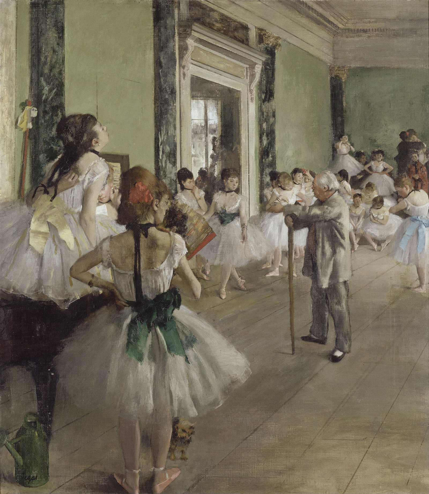
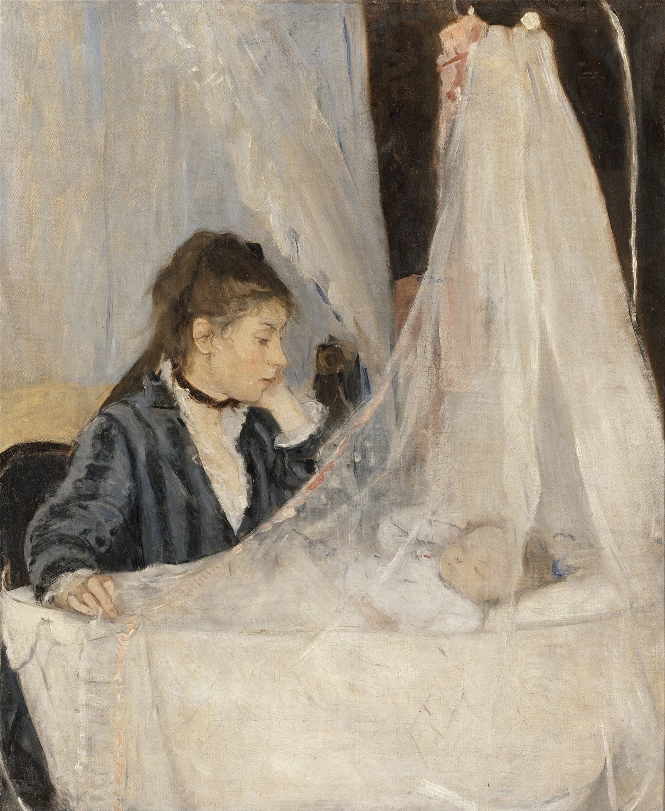

# Lesson 13 — 2026-07-07

- **Lane / Unit:** art / art-impressionism
- **Topics:** art-imp-movement
- **Size / model:** standard / opus
- **Usage:** 434,896 tokens (30 in / 12,998 out / 421,868 cache) · ≈ $7.62 API-equiv · 15 turns · 1h 0m
- **Commit timing:** compose 155.8s · validate 22ms · write 70ms · archive 1ms (through archive 155.9s)
- **Committed:** 2026-07-08T03:25:09.868Z

> Art lane, standard session. Completed art-imp-movement by breaking the tidy 'paint fleeting light outdoors fast' myth through the two founding fractures. Warm-up: J reconstructed Impressionism's core claim (crown moves from imagined ideal to optical sensation) and, pushed one step, reached PAST last lesson on his own — moved from the shallow procedural account of visible brushwork (speed byproduct) to the deeper perceptual one (vision isn't uniform HD), which I sharpened into optical mixing (unmixed dabs fused on the retina; the mark is the point, not an accident). Beat 1 — Degas (The Ballet Class): J read the fracture — no transient-light thesis, flat interior, and crucially the figures stay DRAWN (detailed faces, preserved form). Established Degas as the indoor draftsman who kept academic contour and despised plein air, yet was a founder. J found the shared thread himself: not technique but SUBJECT — modern life (tied back to Baudelaire's painter-of-modern-life). Then the photographic-framing sub-beat: J correctly named the camera but self-flagged the objection that early cameras needed long exposures — resolved that the borrowing is the camera's accidental GRAMMAR of framing (cut-off figures, off-center, empty foreground), not candid speed; added japonisme + Muybridge (1878). Beat 2 — Morisot (The Cradle): tested her on the technique axis; J first misread the handling as 'very detailed' (fixated on the mother's face), corrected on a nudge to see the loose feathery optical surface — so she FITS the technique story (purer than Degas) and her fracture is elsewhere. J derived it: public (male flaneur's city) vs private/domestic modernity, the caretaker's world she actually had access to. Handed him the dignity-axis tension (dismissive 'she got the scraps' vs rebellion read); J built the second read himself — domestic/feminine life as equally worthy a subject; I added the from-the-inside vantage (vs male gaze). Synthesis: J defined Impressionism as fidelity to lived contemporary experience across different frontiers; I added the institutional glue he couldn't derive from canvases — Impressionism as a SECESSION (1874 independent show vs the Salon), a coalition defined by a shared enemy and exhibition wall, name from a critic's insult. Closing history aside (web-verified): Morisot respected in her own time (7/8 shows, organized the 1886 final show, outsold Monet/Renoir/Sisley) but praised condescendingly as 'feminine'; the real erasure is posthumous 20th-C canon-building.

---
### Tutor

Welcome back — you're in the **Modern Art lane**, standard session, picking up where L11 left off.

Last time you *derived* Impressionism almost whole: you inverted the academic "mind over eye" pin and landed the whole program — bottom-of-the-hierarchy subjects, visible brushwork, optical sensation as the only real thing. We previewed the transient-light core (Monet's series, the paint-tube-enables-plein-air aside).

So the tidy story right now is: **"paint fleeting light, outdoors, fast."** Clean, quotable — and a bit of a myth.

The plan for today is to **break that myth** by meeting the actual people. Two of the founding Impressionists don't fit the slogan at all:
- **Degas** — worked *indoors*, prized *drawing*, and despised painting outdoors.
- **Morisot** — a founding member usually left off the list, painting domestic interiors.

If Impressionism were really just "light, outdoors, fast," neither should count. The interesting question is *why they do.* That's the arc — image-led, as you liked it.

Sound good? Before I show you anything, one quick warm-up to see where you're standing:

**From memory — what actually made a canvas "Impressionist"?** Not the subject matter, but the *technique and the underlying claim about what painting is for.* Give me your best reconstruction.

### J

It’s a shift away from a perfected, refined, imagined representation of something and towards depicting what the eye actually sees.

### Tutor

That's the core claim, exactly — the crown moves from the *imagined ideal* to *optical sensation*. The eye, the despised mechanical faculty, gets promoted to the only thing that's real.

Now push it one step into the paint itself. That claim — "record what the eye actually sees" — has a consequence for **how the marks sit on the canvas**. The academic surface was porcelain-smooth, brushwork invisible. Impressionist surfaces are the opposite: broken, loose, visible dabs.

**Why?** What is it about "capturing genuine optical sensation" that *forces* the brushwork to become visible — rather than that just being a stylistic taste?

### J

Last lesson, we talked about it as a procedural byproduct of capturing fleeting light or objects, but I imagine it’s deeper than that. Perhaps a sense that when you’re looking at something in real life, not everything will be on high definition either: maybe what you’re focusing on will be clear, but the periphery is hazy, not perfect.

### Tutor

Both are right, and you just reached past last lesson on your own — good. There are really two arguments stacked here:

1. **The procedural one** (last time): speed forces loose marks. Real, but shallow — it makes the brushwork an *accident*.
2. **The perceptual one** (yours just now): vision itself isn't uniform HD. This is the deeper claim, and it makes the brushwork *honest* rather than accidental.

Your "focus sharp, periphery hazy" instinct points at something the Impressionists pushed even further: **optical mixing.** Stand close to a Monet and a "green" field is actually separate dabs of blue and yellow sitting side by side — unmixed. Step back and *your eye* fuses them. They offloaded the final blending from the palette onto your retina. That's the perceptual claim made literal: the painting isn't a finished object, it's raw optical data your visual system completes. The visible mark is the *point*, not a byproduct.

Good. Hold that — "record raw optical sensation, let the eye finish it" — because now I want to break it.

Here's a founding Impressionist, exhibited in their very first 1874 show:

Edgar Degas, *The Ballet Class* (c. 1873–76). Take a real look at it.

**Where does this painting seem to violate the "record fleeting outdoor light in loose optical dabs" story?** Name what you actually see that doesn't fit.

### J

The lighting seems relatively even, few shadows, no real effects of light at all

### Tutor

Right — the whole "transient light is the subject" thesis is just *absent*. No colored shadows, no sun through leaves, no time-of-day drama. Light isn't the point here at all. It's an interior, lit flatly.

Now look harder at the **dancers themselves** — specifically their edges and faces compared to a Monet or Renoir. In an optical-mixing Impressionist canvas, form dissolves into dabs; a face is a smudge that resolves at distance.

What's different about how the figures here are *rendered*? What is Degas clearly refusing to give up?

### J

The faces are full of detail. Mosf of the ones looking forward have all the facial features, with some expressions. There’s no sense that the face is just an impression.

### Tutor

Exactly. Degas keeps **drawing** — contour, structure, the built human figure. Form is never surrendered to the eye's blur. He was a fanatical draftsman; his own line was *"Draw lines, young man, many lines."* He sneered at painting outdoors — called the plein-air painters' habit something close to a police matter, said *"No art was ever less spontaneous than mine."* Everything you just listed, he did on purpose.

So here's the fracture, sharp:

Degas **rejects** light-as-subject, **rejects** plein air, **rejects** dissolving form into optical dabs, and **keeps** academic draftsmanship — the very thing Impressionism supposedly overthrew.

And yet he wasn't a fellow-traveler or a footnote. He was a *founder* — he helped organize the independent exhibitions, showed in nearly all of them, was central to the group.

**So what could he possibly have shared with Monet and Renoir?** If it isn't light, isn't outdoors, isn't the loose optical surface — what's the common thread that makes all three of them the same rebellion? Take a real swing at it.

### J

Even if the faces have detail, it’s clear that this is a departure from the picturesque smooth sheen of the predecessors. You can tell that this is painted, especially in the blocks of color and in the background.

### Tutor

Yes — that's one real thread: **rejection of the academic licked finish.** The Salon demanded a surface that hid all evidence of the hand; every one of these painters refuses that. You can *see* it was made. That's shared, and it's not nothing.

But there's a bigger common thread, and you'll find it by asking a different question — not *how* it's painted but ***what it's a painting of.***

Line up the subjects: Monet paints a train station and a boulevard; Renoir paints a crowded dance hall in Montmartre; Degas paints a backstage ballet rehearsal. Now compare that to what the Academy wanted — Cabanel's *Venus*, gods and myths and history.

**What do the Impressionists' subjects have in common with each other — and how is that itself a rebellion, independent of technique?** What kind of world are all three of them choosing to paint?

### J

Right — they’re capturing scenes from a real, modern, human world.

### Tutor

That's the pin. Write it down:

> **The shared rebellion isn't a technique — it's a subject. All of them turned to paint *modern life*: the contemporary, the everyday, the actual world they lived in.** Technique is where they *diverge* (Monet's dabs vs. Degas's drawing); modernity is where they *unite*.

This is exactly Baudelaire's demand from last lesson — *"the painter of modern life"* — the artist whose job is to extract the eternal from the fleeting, the heroism of *present* existence. Monet does it with an outdoor sun; Degas does it with a rehearsal room. Same war, different weapon.

And Degas has one more distinctly *modern* trick that isn't about light at all. Look at the composition again — the framing:

Notice how it's built: the empty floor dominating the foreground, dancers shoved to the edges, some figures *cut off* by the frame, nobody centered or posed for us. It looks less like a composed tableau than like a **snapshot** — a moment glimpsed.

**What new technology of the 1870s do you think is shaping how Degas frames a scene like this?** What is he borrowing from?

### J

You wrote snapshot, so my mind immediately went to camera, but I’m not seeing the connection. I thought back then cameras needed to be posed for?

### Tutor

Your instinct is right *and* your objection is right — that's the interesting part, so let me honor both.

**You're correct about the tech:** early photography needed long exposures. A portrait meant sitting frozen; you couldn't yet freeze a dancer mid-motion in 1874. So Degas is *not* copying actual candid action shots — those barely existed.

**But the influence isn't the snapshot's speed — it's its *grammar of framing.*** Here's the connection you're missing. Even a slow, posed photograph does something no academic painter would ever do on purpose: the camera is *dumb*. It crops wherever the frame happens to fall. It slices a figure in half at the edge. It puts a lamppost dead center and a person off in the corner. It doesn't arrange a balanced tableau — it just *takes a rectangle out of the world.*

Academic composition was the opposite: everything centered, balanced, pyramidal, arranged for the viewer. Photography flooded the culture with millions of images that broke those rules by mechanical accident — and artists started to see that "accidental" framing as **truer to how we actually glimpse the world.** You don't see life pre-composed; you catch a corner of it.

So Degas borrows the *look of the accident*: the cut-off figures, the empty foreground, the off-center pile-up. It reads as "a moment caught" even though it's meticulously constructed. (*"No art was ever less spontaneous than mine"* — remember?) The candor is an illusion built on purpose.

Two footnotes, both real:
- **Japanese prints** (*ukiyo-e*, newly flooding Paris after 1854) did the exact same radical asymmetric cropping — a double source pushing the same way.
- Degas *did* get his frozen motion later: he became obsessed with **Muybridge's** stop-motion horse photographs (1878) and used them for his racehorse and dancer poses.

So — good catch. The camera shapes the *eye*, not the shutter speed.

Ready to meet the second person who breaks the myth? She breaks it differently.

### J

Yes! This is fascinating.

### Tutor

Here she is — a **founding** member of the group, in the first 1874 show and almost every one after, and still the one most often dropped from the headline list:

Berthe Morisot, *The Cradle* (1872). A mother — Morisot's sister Edma — watching over her sleeping baby.

Degas broke the myth on **technique** (he kept drawing, refused the loose optical surface). So let's test Morisot on the same axis first.

Look at the *handling* — the brushwork, the light, the veil of gauze over the cradle, the edges of things. **Does Morisot break the "loose optical surface" story the way Degas did, or does she fit it?** What do you see in how it's painted?

### J

Looks to me like she breaks it too — it’s very detailed, and the lighting is uniform.

### Tutor

Let me push back on that — look again, and at specific zones, not the whole.

Yes, the mother's *face* is fairly defined (Morisot gives the emotional center some structure). But scan the rest: the **gauze veil** draped over the cradle, the **curtain at the left edge**, the baby half-lost under the netting, her **dress**. Is that "very detailed" — crisp, described, licked-smooth the way Bouguereau or even Degas's dancers are?

Or is something else happening in those passages? Look hard at the veil especially and tell me what the *paint* is actually doing there.

### J

Good catch that I was focused on the mother. It’s definitely letting your eyes do the work when you take a step back — looking up close, you can really see the individual brush strokes, especially for marking edges or generating a sense of texture

### Tutor

There it is. Morisot is actually one of the *purest* Impressionist hands in the whole group — feathery, translucent, the paint openly declaring itself and your eye fusing it at distance. So on the technique axis, she's not a fracture at all. **She's more Impressionist than Degas.**

So her challenge to the myth has to be somewhere else. Let's find it in the **subject** — but a different angle than Degas.

Put the subjects side by side:
- **Monet** — a boulevard, a train station, a riverbank.
- **Renoir** — a packed public dance hall in Montmartre.
- **Degas** — backstage at the ballet, cafés, the racetrack.
- **Morisot** — *this*: a mother and a cradle, in a private room.

All of them are "modern life." But there's a pattern in the boys' list that Morisot's subject doesn't share — a pattern about *where* those scenes happen and *who gets to go there.*

**What's different about the kind of space Morisot paints versus the spaces the men paint — and why do you think that difference exists?** Think about who she was and what world was actually open to her.

### J

The men are painting about modern public life, but she is painting a modern private life, especially the one of the caretaker who must stay at home.

### Tutor

Exactly right, and that distinction has a name worth knowing. Baudelaire's ideal modern artist was the **flâneur** — the man who strolls the city, anonymous in the crowd, drinking in cafés and boulevards and dance halls. It's the whole romance of the Impressionist project. And it was **structurally male.** A respectable bourgeois woman in 1870s Paris could not wander into a café, a bar, a backstage, or a dance hall alone without scandal. That world was simply closed to Morisot.

So she painted the world that *wasn't* closed: drawing rooms, gardens, nurseries, women at their toilette, the intimate domestic interior. Not because she couldn't handle a boulevard — because the boulevard wouldn't have her.

Now here's the tension I want you to sit with, and it reaches back to last lesson's **hierarchy of genres.**

You could tell this story two ways:
1. **The dismissive read:** Morisot got the *scraps.* The men painted the exciting, spectacular, public face of modernity; she was stuck with cradles and teacups — a *minor* corner of the subject. Charming, but lesser.
2. **The other read:** something more interesting is going on.

Remember the academic hierarchy ranked subjects by *dignity* — history and gods at the top, domestic genre scenes near the bottom. Given that, and given what Impressionism was *for* —

**Is Morisot's domestic subject a limitation that makes her a lesser painter, or is her insistence on it actually its own rebellion? Make the case for the second read.** What is she *arguing* by painting a cradle with total seriousness?

### J

I’m just guessing here, but is she insisting that this life and these people (women) is equally worthy as a subject, equally interesting, equally deserving of being depicted and having its story told?

### Tutor

That's not a guess, that's the argument — and stated well. She's making a claim on the **dignity axis** directly: this life, these people, this quiet labor of care is *worth the same grave attention* Monet gives a cathedral. She paints a cradle with the seriousness the Academy reserved for gods.

And there's one more turn that makes it sharper — about **point of view.** Look at how the *men* painted women: Degas's dancers are watched from the audience or the wings; Renoir's women are lovely objects in a crowd; there's a whole apparatus art historians call the *male gaze* — woman as spectacle, seen from outside. Morisot paints women **from the inside** — as subjects with interior lives, absorbed in their own experience, not performing for a viewer. Edma isn't posed for us; she's lost in a thought we're not entitled to. That's not just a new *subject*, it's a new *vantage* — the world of women rendered by someone who lived in it.

(This is exactly why art history has spent the last few decades *putting her back* on the founder's list — the "too often left off" is being actively corrected.)

So let's pull the whole thread together. You've now met three "Impressionists":
- **Monet** — loose optical surface, outdoor light, public modernity.
- **Degas** — crisp draftsmanship, indoor, photographic framing, public modernity.
- **Morisot** — pure optical surface, private/domestic modernity, from the inside.

Every single one of them violates *someone's* version of "the Impressionist rule."

**So — what actually held this group together as one movement, if not a shared technique or even a shared subject?** Give me the tightest definition of Impressionism you can that fits all three.

### J

A rebellion against the academy’s tradition on what subjects are valuable and what techniques should be valued in depicting them? A prioritization in the “realistic” depiction of human life, not in the literal sense (eg hyperrealism), but manifested in many different deviations from what came before: in realistic subject matter, in realistic framing and lighting, in realistic perspective

### Tutor

That's a genuinely strong definition, and the phrase doing the real work is your careful scare-quoted **"realistic."** Let me sharpen it and add the one piece you can't derive from the paintings alone.

Sharpening: the unifying commitment is best stated as **fidelity to *actual, lived, contemporary experience*** — not photographic accuracy, but truth to how the world is really *encountered*. And notice each painter picks a different facet of "how it's really encountered":
- Monet → how light *actually strikes the eye* (perceptual fidelity),
- Degas → how a scene is *actually glimpsed*, off-center and cropped (fidelity of the momentary look),
- Morisot → how a life is *actually lived*, from inside (experiential fidelity).

Same loyalty to the real-as-experienced, three different frontiers. You had this — I'm just naming the axis.

Now the piece the canvases hide, and it's the deepest answer to "what held them together": **Impressionism was never a doctrine — it was a *secession.*** There was no manifesto, no shared rulebook. What literally made them a group was a *political act*: in 1874 a band of artists, rejected by or fed up with the official **Salon**, pooled their money and mounted their **own independent exhibition**, outside the state system. The thing they truly had in common was **a shared enemy and a shared wall to hang on.** The name "Impressionism" itself was a *critic's insult* thrown at that first show.

That's *why* the movement can hold a plein-air optical purist, an indoor draftsman who despised painting outdoors, and a woman painting nurseries from the inside — all at once. It was a coalition of independents, defined by what they *rejected* and where they *exhibited*, far more than by any single method. Your "many different deviations from what came before" is exactly right — the deviations are the point; the shared *before* is the glue.

That closes today's arc cleanly: **the myth was "paint fleeting light outdoors fast"; the reality is a fractured coalition united by rebellion and a shared exhibition wall.**

Good natural stopping point here. We could stop, or if you've got appetite I can preview where this fractures *next* — the four Post-Impressionists who each said "Impressionism isn't enough" for four different reasons (Cézanne, Van Gogh, Gauguin, Seurat). Your call.

### J

I imagine that’s next lesson? If so we can stop here. If not go ahead.

### Tutor

Yes — Post-Impressionism is exactly next lesson (Cézanne, Van Gogh, Gauguin, Seurat, each a distinct "Impressionism isn't enough" argument). So this is a clean place to stop.

**Quick recap of today:**
- The tidy myth — *"paint fleeting light, outdoors, fast"* — is a myth. You broke it by meeting the actual founders.
- **Degas:** fits the *modern-life subject* but breaks the *technique* — a fanatical draftsman who kept crisp form, worked indoors, despised plein air, and borrowed the camera's (and Japanese prints') **accidental framing** to make constructed scenes look glimpsed. You caught the exposure-time objection yourself — the camera shaped the *eye*, not the shutter.
- **Morisot:** the opposite fracture — *purest* Impressionist surface, but her rebellion is in subject-and-vantage: the private, domestic world painted **from the inside**, insisting women's experience is as serious a subject as any cathedral. A claim on the *dignity axis*, and why she's being restored to the founders' list.
- **The synthesis you built:** Impressionism isn't a shared technique or even a shared subject — it's **fidelity to lived contemporary experience** across different frontiers, held together institutionally by a **secession**: rejected artists mounting their own show against the Salon. A coalition defined by its enemy.

You drove essentially all of it — including the two sharpest turns (the camera objection, and the Morisot dignity argument) largely on your own.

Before I close the session — **any last questions on Degas, Morisot, or how the group hung together?**

### J

Was Morisot also often overlooked during her time, or is she only forgotten in contemporary art history?

### Tutor

Great question — and the answer is a genuinely interesting "both, but in different ways."

Let me verify the specifics before I state them.

### Tutor

Verified — here's the honest picture, and it's a "both, but differently":

**In her own time — not overlooked, genuinely respected.** Morisot was a *core* member, not a hanger-on. She showed in **seven of the eight** Impressionist exhibitions (1874–1886) — a record second only to Pissarro, missing just 1879 when her daughter Julie was born — and she **single-handedly organized the final 1886 show.** Her male colleagues regarded her as a full equal, which was extraordinary for the era, and commercially she **outsold Monet, Renoir, and Sisley.** So within the group and the market, she was no footnote.

**But** — the condescension was already there in *how* she was praised. Critics ridiculed her work (as they did all the Impressionists), and when they *did* admire it, they filed it under "feminine" virtues: intuition, spontaneity, delicacy, grace. Praise that quietly re-cages her — she's good *for a woman*, her gifts are "natural" rather than intellectual. So even the admiration carried the seed of the later sidelining.

**The real erasure is posthumous.** The 20th-century textbook canon — the "big four" headline version of Impressionism — is what dropped her, precisely by taking that "feminine/minor" framing at face value. So: respected in life, written *down* after death, and being written *back in* now.

Sources: [Wikipedia — Berthe Morisot](https://en.wikipedia.org/wiki/Berthe_Morisot), [The Art Story — Berthe Morisot](https://www.theartstory.org/artist/morisot-berthe/), [National Museum of Women in the Arts](https://nmwa.org/art/artists/berthe-morisot/).

That's a fitting last note — the exact mechanism by which a founder gets "too often left off the list."

I'll close and save the session now.

### Tutor

Ah — one rating came through at save time. Let me fold it in and re-commit.
